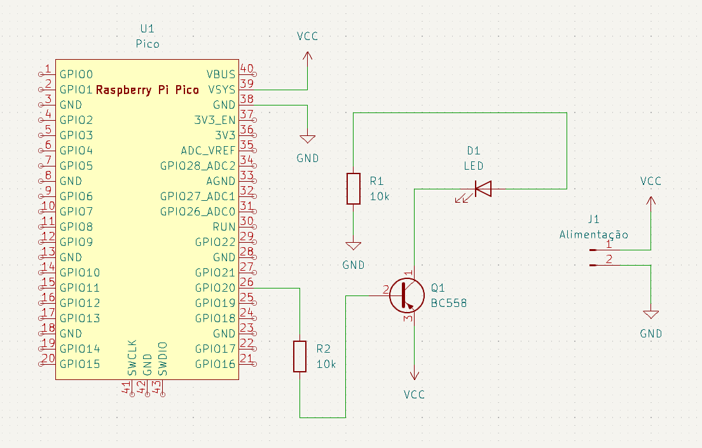

# Projeto de Placa de Circuito Impresso com Raspberry Pi Pico W - José Vitor Alencar

## Descrição
Este repositório contém os arquivos e recursos necessários para a construção de uma placa de circuito impresso (PCB) projetada para acoplar um Raspberry Pi Pico W. A placa inclui um dispositivo de acionamento de potência (transistor neste caso), um dispositivo sinalizador (LED neste caso) e um dispositivo de entrada (analógico ou digital). 

## Componentes
- **Raspberry Pi Pico W:** Responsável pelo controle e processamento.
- **Transistor:** Utilizado para o acionamento de cargas ou dispositivos externos.
- **LED:** Serve como dispositivo de sinalização para o usuário.

## Estrutura do Repositório

```
/
├── circuito
│   ├── circuito-backups
│   ├── gerber-files # Arquivos gerber para fabricação
│   └── circuito.kicad # Arquivos kicad do circuito
├── src
│   └── teste.py  # Script principal para testar a pcb com o Raspberry Pi Pico W
└── README.md
```

## Imagens
### Esquemático no KiCad

*Figura 1: Esquemático do projeto desenvolvido no KiCad.*

### Editor de PCI no KiCad

*Figura 2: Layout da placa no editor de PCI do KiCad.*

## Como Usar
O diretório `circuito` contém os arquivos para o kicad. O diretório `src` tem um arquivo teste em python. 
